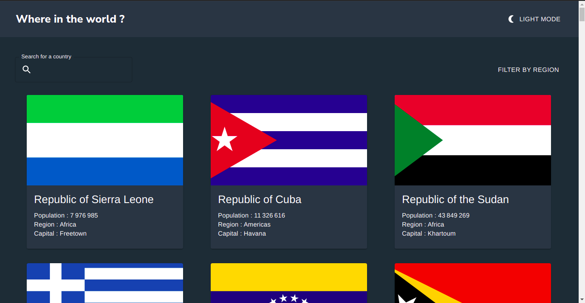
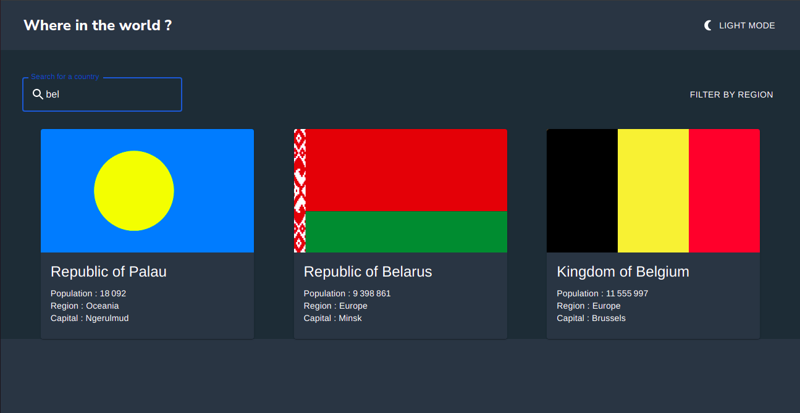
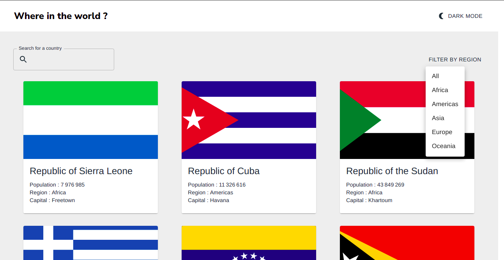

# Frontend Mentor - REST Countries API with color theme switcher solution

This is a solution to the [REST Countries API with color theme switcher challenge on Frontend Mentor](https://www.frontendmentor.io/challenges/rest-countries-api-with-color-theme-switcher-5cacc469fec04111f7b848ca). Frontend Mentor challenges help you improve your coding skills by building realistic projects. 

## Table of contents

- [Frontend Mentor - REST Countries API with color theme switcher solution](#frontend-mentor---rest-countries-api-with-color-theme-switcher-solution)
  - [Table of contents](#table-of-contents)
  - [Overview](#overview)
    - [The challenge](#the-challenge)
    - [Screenshot](#screenshot)
    - [Links](#links)
  - [My process](#my-process)
    - [Built with](#built-with)
  - [Author](#author)
  - [Acknowledgments](#acknowledgments)

**Note: Delete this note and update the table of contents based on what sections you keep.**

## Overview

### The challenge

Users should be able to:

- See all countries from the API on the homepage
- Search for a country using an `input` field
- Filter countries by region
- Click on a country to see more detailed information on a separate page -- **I personnaly prefered a modal**
- Click through to the border countries on the detail page -- **Not yet implemented**
- Toggle the color scheme between light and dark mode *(optional)*

### Screenshot

Here are three screenshot of the application that display the homepage in Dark & Light mode + the searchbar and the filter.

### Links

- Live Site URL: [Right here](https://restapicountry.netlify.app/)

## My process

I use the power of React and it's reusable components to dinamicaly display the different datas in the same component.

- Created the layout and the components that I'll need later. 
- Fetched the datas for the homepage.
- Created the globalStyles and applied it to the homepage. 
- Created the Dark and Light modes (thanks globalStyles).
- Created the searchbar with a separated fetch.
- Created the filter.
- Created the modals displaying the details of each country.

### Built with

- [React](https://reactjs.org/) - JS library
- [MaterialUI](https://mui.com/) - React library
- [Styled Components](https://styled-components.com/) - For styles
## Author

- Website - [Freyaln](https://restapicountry.netlify.app/)
- Frontend Mentor - [@Freyaln](https://www.frontendmentor.io/profile/Freyaln)

## Acknowledgments

Thanks to @SalukiMakingCode to his help with the modal logic.
